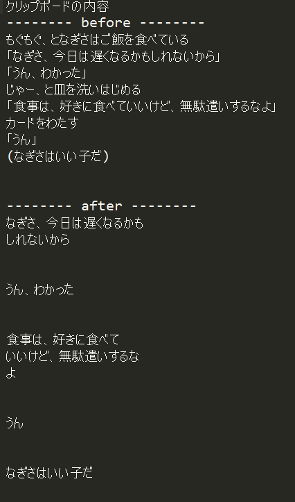

# clip studio speak converter
漫画のシナリオ用テキストからclip studio paint 上のセリフに流し込んでいくスクリプト  
windows 用の mecab-python が今までうまく入らなかったので保留していたが、再開  

## convertCspText.py
本体。「」や()等で囲われたセリフから「」（）記号を排除、長い文を複数の行に変換する  
mecab使用の場合、文末が意味のある単語区切りになるように、使用でなければ単に文字数で改行する  
  
テキストの区切りを判定する記号は下記のもので、外にあるテキストは除去される  
  
+ 「」 :会話の内容、口に出して喋っている内容
+ （） :考え事、思っていること
+ <>  :説明、モノログなど四角で囲った内容  

### copy_paste.py
macでのクリップボード処理用  
  
### speakingConvertPage.py / speakingConvertScene.py / speakingConvert.py  
それぞれページ単位、複数頁でのシーン単位、段単位で使用
